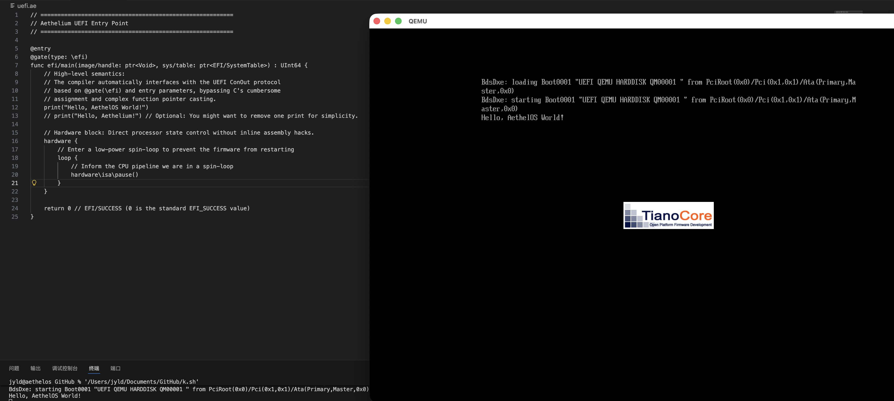

# Aethelium: A Hardware-First, Runtime-Less Systems Language Toolchain

[中文](README_CN.md)

> **A hardware-first, runtime-less systems language toolchain built for modern low-level programming.**

**Aethelium** is an independent, self-contained systems programming language toolchain. It bypasses the cumbersome traditional "compiler-assembler-linker" workflow, focusing on providing an ultra-streamlined build solution for **UEFI environments** and **bare-metal** development.

This repository contains the **Bootstrap Core** of Aethelium. It is capable of generating native machine code or UEFI PE executables for target architectures directly on a host machine (macOS/Linux), without relying on standard object files (`.obj`/`.o`) or external linkers.

---

## 🏗 Core Architecture

Aethelium utilizes a unique **"Weaver-Filler"** dual-engine architecture, achieving a direct mapping from high-level semantics to silicon logic:

*   **Binary Weaver (`toolsASM`)**:
    Responsible for the physical orchestration of the low-level binary layout.
*   **Logic Filler (`toolsC`)**:
    A compiler frontend implemented in C. It handles semantic analysis and AST construction for Aethelium syntax, precisely "filling" the generated machine code logic into the memory slots preset by the Weaver.

### Directory Structure

```text
Aethelium/
├── Makefile                # Unified build orchestration system
├── README.md               # Technical documentation
└── core/                   # Core toolchain source code
    ├── toolsC/             # [Frontend] Compiler frontend & logic filling layer
    │   ├── include/        #   - Core headers (binary format specs, AEFS protocol)
    │   ├── aetb/           #   - AETB intermediate format generation engine
    │   ├── compiler/       #   - Main logic for lexical/syntax analysis & code gen
    │   └── mkiso/aefs/     #   - Boot media and file system support
    └── toolsASM/           # [Backend] Binary Weaver & assembly emission layer
        ├── include/        #   - Assembly interface definitions
        └── src/            #   - Core instruction emission & layout implementation (NASM)
```

---

## 🛠 Build Workflow

### Prerequisites

Building the Aethelium toolchain requires the following environment:

| Component | Requirement | Description |
| :--- | :--- | :--- |
| **Compiler** | Clang / GCC | C11 support required; Clang recommended |
| **Assembler** | NASM 2.15+ | Used for backend binary orchestration |
| **Build System** | GNU Make 4.0+ | Automated build management |

*Source compilation supports: Darwin (macOS) x86_64/arm64. Final output supports: macOS x86_64/arm64 and Windows x86_64.*

### Build Commands

Execute the following in the repository root:

1.  **Environment Check**
    ```bash
    make check-platform
    ```

2.  **Build Core Compiler**
    ```bash
    make all
    ```
    *Note: This command automatically compiles `toolsC` and `toolsASM`, linking them into the final `aethelc` executable.*

3.  **Verification**
    Once built, the compiler binary will be located at:
    ```text
    build/output/aethelc
    ```

### Other Operations

```bash
make clean          # Remove intermediate build files
make distclean      # Reset repository to initial state
make status         # View current build artifact information
```

---

## ⚡ Technical Features

*   **Runtime-less**: Aethelium does not depend on `libc` or any complex runtime environment. Generated binaries contain zero redundancy beyond hardware instructions.
*   **Direct UEFI Emission**: The compiler features built-in PE32+ format generation. A single command produces a `.efi` application without requiring massive frameworks like EDK II.
*   **Declarative Hardware Control**: Use semantics like `@gate` and `@packed` to achieve precise control over memory alignment, calling conventions, and register behavior at the high-level language layer.

---

## 📺 Demo & Aesthetics


*Aethelium running a "Hello World" UEFI app in QEMU (OVMF).*

### The Aethelium Flavor
```aethelium
@entry
@gate(type: \efi)
func efi/main(image/handle: ptr<Void>, sys/table: ptr<EFI/SystemTable>) : UInt64 {
    // Navigable hierarchy: sys/cpu/id, efi/con_out...
    print("Hello, AethelOS World!")

    hardware {
        loop {
            hardware\isa\pause() // Direct ISA passthrough
        }
    }
    return 0 
}
```
*More examples are located in the examples directory.*

---

## User Manuals

*   **Aethelium Language Reference Manual.md**: Quick language reference.
*   **Hardware Layer Manual_Machine Code Cross-Reference_2026-03-06.md**: Hardware layer mapping tables.

---

## ⚠️ Notes

*   **Target Output**: The binaries generated by this toolchain are typically in **Aethelium Native**, **x86 Machine Code**, or **UEFI PE** formats. They cannot be executed directly on a Windows or Linux host (unless within a VM or bare-metal environment).
*   **Cross-Compilation**: The toolchain provided in this repository is essentially a cross-compiler running on a host machine.

---

## 📄 License

This project is licensed under the **GNU General Public License v3.0 (GPLv3)**.

**Copyright (C) 2024-2026 Aethel-Systems. All rights reserved.**